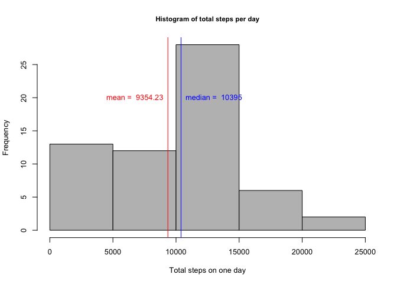
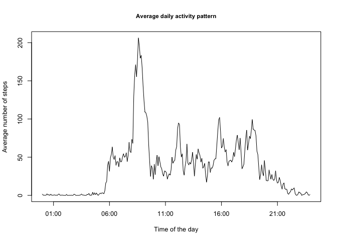
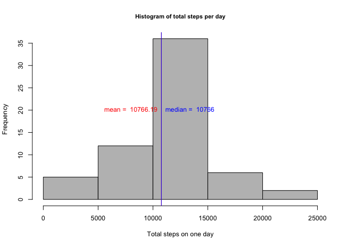
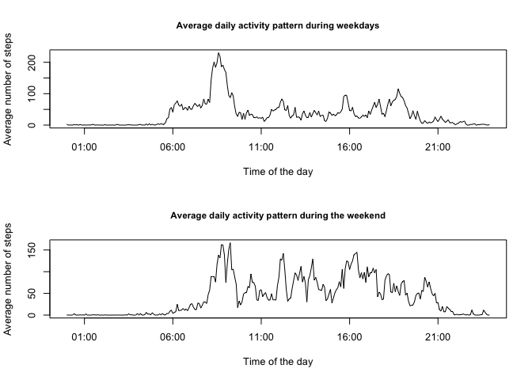

# Reproducible Research: Peer Assessment 1


## Loading and preprocessing the data

First of all I unzip the data file, then I load the data. The interval is read as integer, I transform it into a four-character string with lead zeros, then create a time variable including date and time interval. I also transform the date variable into date format.


```r
unzip("activity.zip")
data <- read.csv("activity.csv", stringsAsFactors = FALSE)
data$time <- sprintf("%04d",data$interval)
data$time <- paste(data$date," ",data$time)
data$time <- strptime(data$time, format = "%Y-%m-%d %H%M")
data$date <- as.Date(data$date)
```

## What is mean total number of steps taken per day?

I compute the total number of steps per day (ignoring NA values), then compute the mean and median values.


```r
totSteps <- tapply(data$steps, data$date, sum, na.rm = TRUE)
mean <- mean(totSteps)
median <- median(totSteps)
```

I plot an histogram of total steps per day, and I add a red vertical line at the **mean value (9354.23)** and a blue vertical line at the **median value (10395)**.


```r
par(cex = 0.8, cex.main = 0.9)
hist(totSteps, col = "grey", main = "Histogram of total steps per day", xlab = "Total steps on one day")
abline(v = mean, col = "red")
abline(v = median, col = "blue")
text(mean, 20, paste("mean = ", round(mean, digits = 2)), pos = 2, col = "red")
text(median, 20, paste("median = ", as.integer(median)), pos = 4, col = "blue")
```

 

## What is the average daily activity pattern?

I compute the average steps per interval across the days and I plot a time series of the average activity at every time of the day. The pattern shows that there is almost no activity in the night hours, and the peak of steps taken is between 8 and 10 in the morning.


```r
averageSteps <- tapply(data$steps, data$interval, mean, na.rm = TRUE)
par(cex = 0.8, cex.main = 0.9)
plot (data$time[1:288], averageSteps, type="l", xlab = "Time of the day", ylab = "Average number of steps", main = "Average daily activity pattern")
```

 

## Imputing missing values

I use the function is.na() to find the missing values in the dataset. 


```r
missing <- is.na(data) 
total <- sum(missing)
```

In the dataset there are 2304 missing values and they are all in the first variable (steps):


```r
sum(missing) == sum(missing[,1])
```

```
## [1] TRUE
```

I use the average steps per interval that I have computed above to impute missing step numbers at the corresponding interval. To do so I have to map the interval value in my data into the index of the averageSteps variable. I do so by transforming it into a factor variable and changing the levels of the factor into integers from 1 to 288 (which is the total number of intervals each day).


```r
missing <- missing[,1]
intervalIndex <- as.factor(data$interval[missing])
levels(intervalIndex) <- c(1:288)
dataNew <- data
dataNew$steps[missing] <- averageSteps[intervalIndex]
```

My new dataset has no missing values:


```r
sum(is.na(dataNew))
```

```
## [1] 0
```

I use the same code as for question 1 to compute the total number of steps per day over my new dataset, then compute the mean and median values.


```r
totStepsNew <- tapply(dataNew$steps, dataNew$date, sum)
meanNew <- mean(totStepsNew)
medianNew <- median(totStepsNew)
```

I plot an histogram of total steps per day including imputed values, and I add a red vertical line at the **mean value (1.076619\times 10^{4})** and a blue vertical line at the **median value (1.0766189\times 10^{4})**.


```r
par(cex = 0.8, cex.main = 0.9)
hist(totStepsNew, col = "grey", main = "Histogram of total steps per day", xlab = "Total steps on one day")
abline(v = meanNew, col = "red")
abline(v = medianNew, col = "blue")
text(meanNew, 20, paste("mean = ", round(meanNew, digits = 2)), pos = 2, col = "red")
text(medianNew, 20, paste("median = ", as.integer(medianNew)), pos = 4, col = "blue")
```

 

Compared to the histogram of question 1, where NA's where ignored, the new histogram presents a higher peak at the mean and median values, that are now almost identical as well. Besides, in the new histogram there are much less occurrences of 0-5000 steps per day. The rest of the distribution has remained basically the same.

## Are there differences in activity patterns between weekdays and weekends?

I create a factor variable based on the variable "date" in my new dataset, and I assign the value "Weekday" to mondeys through fridays and "Weekend" to saturdays and sundays.


```r
dataNew$weekday <- weekdays(data$date)
dataNew$daytype <- sub("Monday|Tuesday|Wednesday|Thursday|Friday", "Weekday", dataNew$weekday, ignore.case = TRUE)
dataNew$daytype <- sub("Saturday|Sunday", "Weekend", dataNew$daytype, ignore.case = TRUE)
dataNew$daytype <- as.factor(dataNew$daytype)
```

Then I make a panel plot of the daily pattern during weekdays and in the weekends so I can compare them. From the plot I can see a difference in the patterns: during weekdays there is a pronounced peak in the morning, whereas the same peak, although still present, is less important in the weekends, where activity is more evenly spread over the whole day.


```r
daytypeSteps <- tapply(dataNew$steps, list(dataNew$interval, dataNew$daytype), mean, na.rm = TRUE)
par(mfrow = c(2,1), cex = 0.8, cex.main = 0.9)
plot (dataNew$time[1:288], daytypeSteps[,1], type="l", xlab = "Time of the day", ylab = "Average number of steps", main = "Average daily activity pattern during weekdays")
plot (dataNew$time[1:288], daytypeSteps[,2], type="l", xlab = "Time of the day", ylab = "Average number of steps", main = "Average daily activity pattern during the weekend")
```

 
